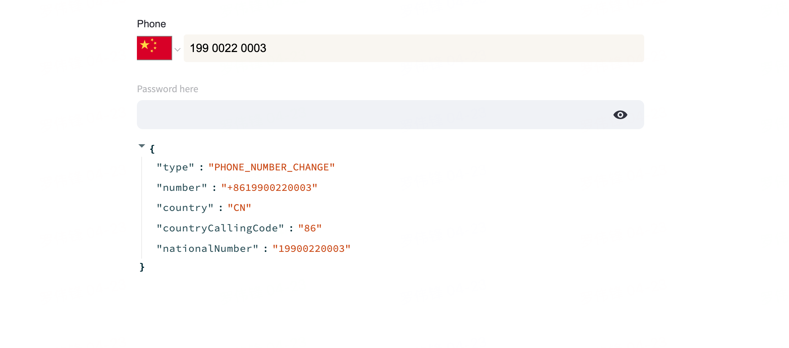

# streamlit-phone-number




## Installation

```bash
pip install streamlit-phone-number
```

## Usage
```python
import streamlit as st

event = st_phone_number("Phone", placeholder="ss", default_country="CN")
st.text_input('Password here', type='password')

st.write(event)
```